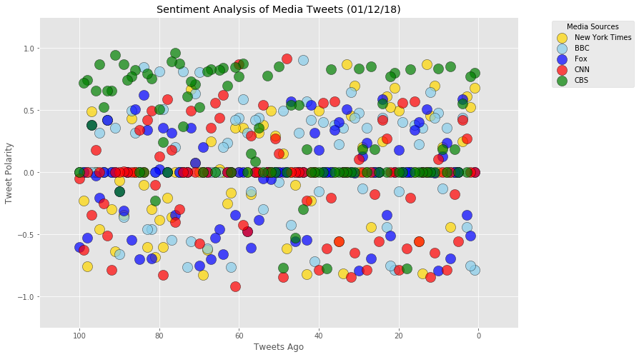
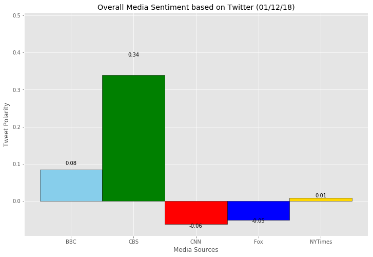

# Analysis:
1. the polarity of tweets for the different media sources has varied from time to time.
2. The tweets of the media source CBS have mostly had a positive compound score when compared to the other sources.
3. The compound score of tweets of New York Times had an equal distribution, meaning almost equal number of positive and negative tweets.


```python
# Dependencies
import tweepy
import numpy as np
import pandas as pd
import matplotlib.pyplot as plt
import time
from datetime import datetime
import yaml

# Import and Initialize Sentiment Analyzer
from vaderSentiment.vaderSentiment import SentimentIntensityAnalyzer
analyzer = SentimentIntensityAnalyzer()
```


```python
# Twitter API Keys
TWITTER_CONFIG_FILE = 'account1.yaml'

with open(TWITTER_CONFIG_FILE, 'r') as config_file:
    config = yaml.load(config_file)

consumer_key = config['twitter']['consumer_key']
consumer_secret = config['twitter']['consumer_secret']
access_token = config['twitter']['access_token']
access_token_secret = config['twitter']['access_token_secret']
```


```python
# Setup Tweepy API Authentication
auth = tweepy.OAuthHandler(consumer_key, consumer_secret)
auth.set_access_token(access_token, access_token_secret)
api = tweepy.API(auth, parser=tweepy.parsers.JSONParser())
```


```python
# Target Users
target_users = ("@BBC", "@CBS", "@CNN", "@FoxNews", "@nytimes")

# Variables for holding sentiments
sentiments = []

for target_user in target_users:
    # Counter
    counter = 1

    # Loop through 5 pages of tweets (total 100 tweets)
    for x in range(5):

        # Get all tweets from home feed
        public_tweets = api.user_timeline(target_user, page=x)

        # Loop through all tweets 
        for tweet in public_tweets:

            # Print Tweets
            # print("Tweet %s: %s" % (counter, tweet["text"]))

            # Run Vader Analysis on each tweet
            compound = analyzer.polarity_scores(tweet["text"])["compound"]
            pos = analyzer.polarity_scores(tweet["text"])["pos"]
            neu = analyzer.polarity_scores(tweet["text"])["neu"]
            neg = analyzer.polarity_scores(tweet["text"])["neg"]
            tweets_ago = counter
            
           
            # Add sentiments for each tweet into an array
            sentiments.append({"Date": tweet["created_at"], 
                               "Compound": compound,
                               "Positive": pos,
                               "Negative": neu,
                               "Neutral": neg,
                               "Tweets Ago": counter,
                               "News Channel": target_user,
                              "Tweet": tweet["text"]})

            # Add to counter 
            counter = counter + 1
```


```python
# Convert sentiments to DataFrame
sentiments_pd = pd.DataFrame.from_dict(sentiments)
sentiments_pd.head()
sentiments_pd.to_csv("news_mood.csv")
```


```python
#Store Values of each media channel in a seperate DataFrame
sentiments_pd.set_index('News Channel', inplace=True)
nyt_df = sentiments_pd.loc['@nytimes']
bbc_df = sentiments_pd.loc['@BBC']
fox_df = sentiments_pd.loc['@FoxNews']
cnn_df = sentiments_pd.loc['@CNN']
cbs_df = sentiments_pd.loc['@CBS']
```


```python
#Create Plot
plt.figure(figsize=(12,8))
plt.style.use('ggplot')
nyt = plt.scatter(nyt_df['Tweets Ago'], nyt_df['Compound'], c = "gold", alpha=0.7, edgecolors="black", s=200)  
bbc = plt.scatter(bbc_df['Tweets Ago'], bbc_df['Compound'], c = "skyblue", alpha=0.7, edgecolors="black", s=200) 
fox = plt.scatter(fox_df['Tweets Ago'], fox_df['Compound'], c = "blue", alpha=0.7, edgecolors="black", s=200) 
cnn = plt.scatter(cnn_df['Tweets Ago'], cnn_df['Compound'], c = "red", alpha=0.7, edgecolors="black", s=200) 
cbs = plt.scatter(cbs_df['Tweets Ago'], cbs_df['Compound'], c = "green", alpha=0.7, edgecolors="black", s=200) 
plt.legend((nyt,bbc,fox,cnn,cbs),
           ("New York Times","BBC","Fox","CNN","CBS"),
           scatterpoints=1,
           bbox_to_anchor=(1.25, 1),
           loc='upper right',
          title="Media Sources")
plt.ylabel("Tweet Polarity")
plt.xlabel("Tweets Ago")
plt.title("Sentiment Analysis of Media Tweets (%s)" % (time.strftime("%x")))
plt.ylim(-1.25,1.25)
plt.xlim(110,-10)
plt.savefig("Sentiment_Analysis_of_Media_Tweets.png")
plt.show()

```





```python
# calculate overall media sentiment for each media ssource
sentiments_df = sentiments_pd.groupby("News Channel").mean()
sentiments_df.reset_index(inplace=True)
sentiments_df
```


<div>
<style>
    .dataframe thead tr:only-child th {
        text-align: right;
    }

    .dataframe thead th {
        text-align: left;
    }

    .dataframe tbody tr th {
        vertical-align: top;
    }
</style>
<table border="1" class="dataframe">
  <thead>
    <tr style="text-align: right;">
      <th></th>
      <th>News Channel</th>
      <th>Compound</th>
      <th>Negative</th>
      <th>Neutral</th>
      <th>Positive</th>
      <th>Tweets Ago</th>
    </tr>
  </thead>
  <tbody>
    <tr>
      <th>0</th>
      <td>@BBC</td>
      <td>0.084390</td>
      <td>0.85399</td>
      <td>0.06517</td>
      <td>0.08086</td>
      <td>50.5</td>
    </tr>
    <tr>
      <th>1</th>
      <td>@CBS</td>
      <td>0.338734</td>
      <td>0.82699</td>
      <td>0.01755</td>
      <td>0.15548</td>
      <td>50.5</td>
    </tr>
    <tr>
      <th>2</th>
      <td>@CNN</td>
      <td>-0.062517</td>
      <td>0.86173</td>
      <td>0.08161</td>
      <td>0.05666</td>
      <td>50.5</td>
    </tr>
    <tr>
      <th>3</th>
      <td>@FoxNews</td>
      <td>-0.050552</td>
      <td>0.84427</td>
      <td>0.09112</td>
      <td>0.06458</td>
      <td>50.5</td>
    </tr>
    <tr>
      <th>4</th>
      <td>@nytimes</td>
      <td>0.008956</td>
      <td>0.85598</td>
      <td>0.07051</td>
      <td>0.07350</td>
      <td>50.5</td>
    </tr>
  </tbody>
</table>
</div>


```python
# define variables for graph
colors = ["skyblue", "green", "red","blue", "gold"]
edgecolor = ["black","black","black","black","black"]
xlabels = ["BBC", "CBS", "CNN", "Fox", "NYTimes"]
x = sentiments_df["News Channel"]
y = sentiments_df.Compound

#Create plot
plt.figure(figsize=(12,8))    
bars = plt.bar(x, y, width=1, color=colors, ec=edgecolor)

# Set the bar value on each bar
for bar in bars:
        height = bar.get_height()
        plt.text(bar.get_x() + bar.get_width()/2., 1.15*height,
                '%s' % (str(float("{0:.2f}".format(height))) ),
                ha='center', color="black")
        
# set ylim for yaxis
ymax = max(sentiments_df.Compound)
ymin = min(sentiments_df.Compound)
if (ymax <0):
    ymax = -(ymax)
if (ymin >0):
    ymin = -(ymin)
plt.ylim(1.5*ymin, 1.5*ymax)
plt.xticks(np.arange(5),xlabels)
plt.title("Overall Media Sentiment based on Twitter (%s)" % (time.strftime("%x")))
plt.ylabel("Tweet Polarity")
plt.xlabel("Media Sources")
plt.savefig("Overall_Media_Sentiment.png")
plt.show()
```




